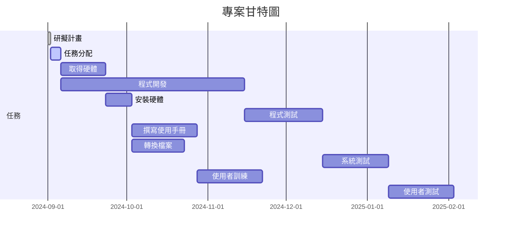

# 表格
| 任務 | 說明 | 需時(天) | 前置任務 |
| 1|延擬計畫|1|-|
| 2|任務分配|4|1|
| 3|取得硬體|17|1|
| 4|程式開發|70|2|
|5|安裝硬體|10|3|
|6|程式測試|30|4|
|7|撰寫使用手冊|25|5|
|8|傳換檔案|20|5|
|9|系統測試|25|6|
|10|使用者續練|20|7,8|
|11|使用者測試|25|9,10|


# PERT/CPM 圖

 ```mermaid
graph TD;
    A1[研擬計畫 - 1天] --> A2[任務分配 - 4天];
    A2 --> A3[取得硬體 - 17天];
    A2 --> A4[程式開發 - 70天];
    A3 --> A5[安裝硬體 - 10天];
    A4 --> A6[程式測試 - 30天];
    A5 --> A7[撰寫使用手冊 - 25天];
    A5 --> A8[轉換檔案 - 20天];
    A6 --> A9[系統測試 - 25天];
    A7 --> A10[使用者訓練 - 25天];
    A8 --> A10;
    A9 --> A11[使用者測試 - 25天];
    A10 --> A11;
```

# 甘特圖



